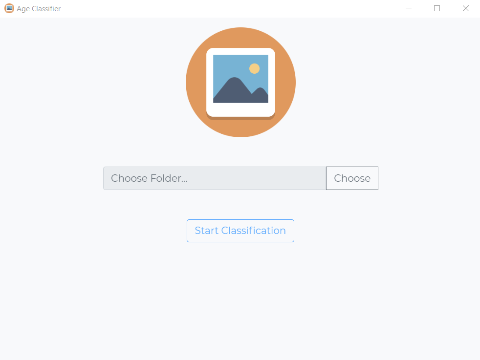
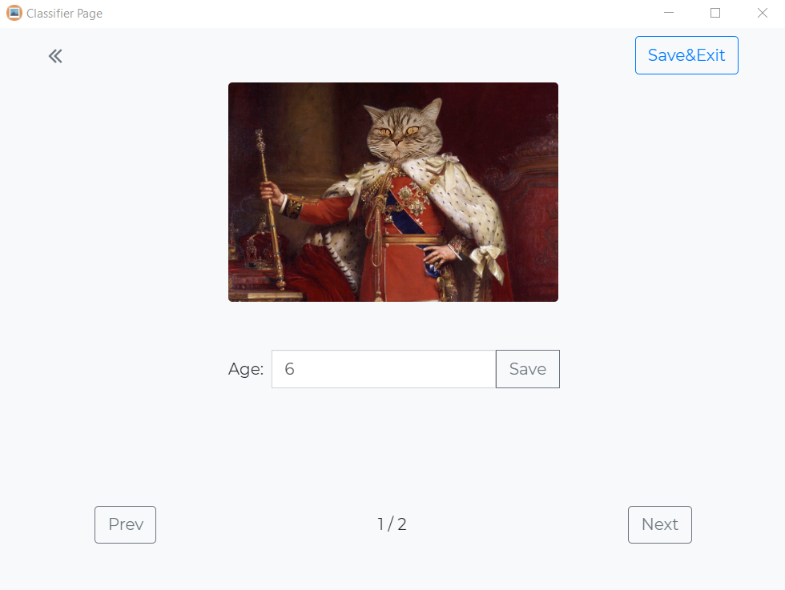
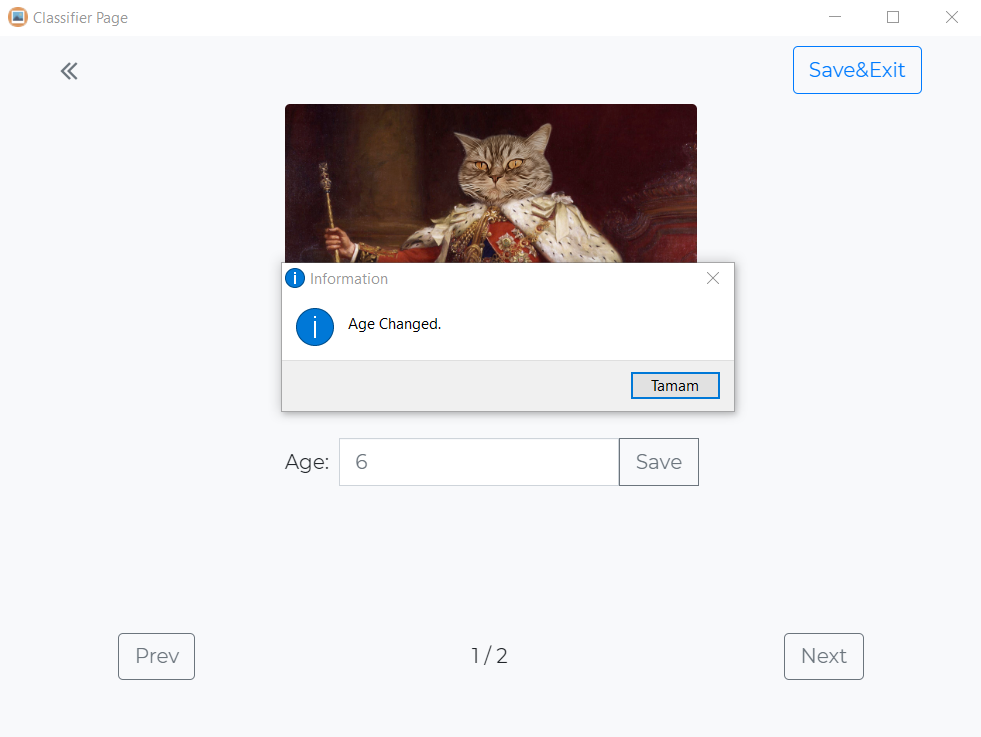
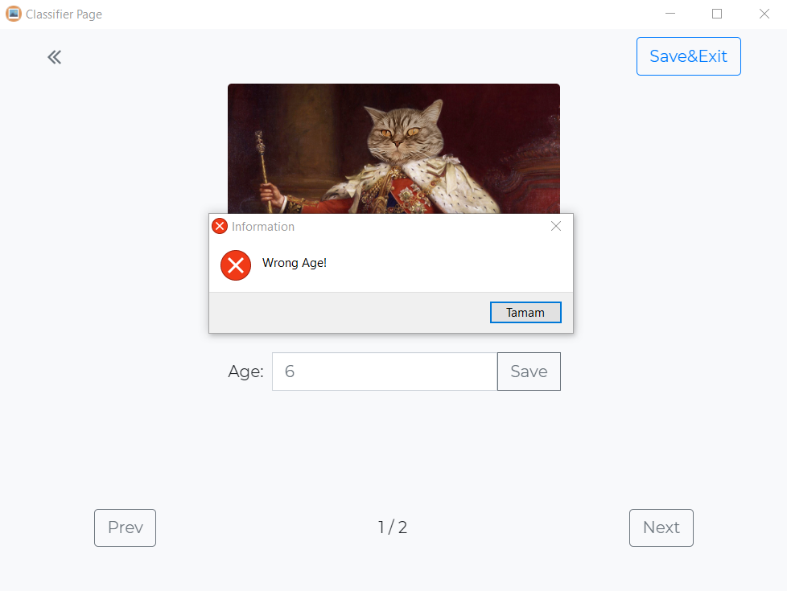
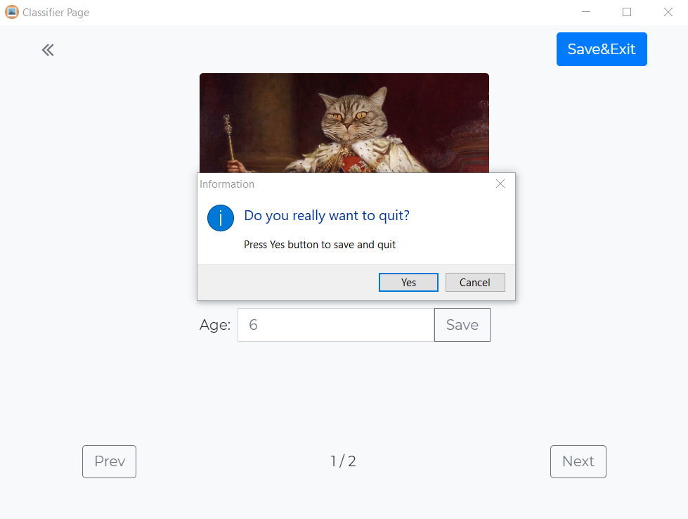

# age-classifier-electron

Seçilen klasördeki tüm resimleri, girilen değere (yaş) göre klasörleyen, sınıflandıran Electron uygulaması.:open_file_folder:

Testler Electron v9.1.0 sürümünde yapıldı.

> - `Klavyeden "sağ", "sol" yön okları ile veya "Prev", "Next" butonları ile resimler arası geçiş yapılabilir.`
> - `Klavyeden "Enter" tuşu ile veya "Save" butonu ile girilen yaş kaydedilebilir.`

> <p align="center"><b><em>Uygulama ana sayfası</em></b></p>
> <p align="center"></p></br>

> <p align="center"><b><em>"Choose" butonu ile klasör seçildikten sonra sınıflandırma sayfası</em></b></p>
> <p align="center"></p></br>

> <p align="center"><b><em>Yaş bilgisi girilip "Save" butonu veya klavyeden "Enter" tuşu ile yaş değiştirilme bilgi diyaloğu</em></b></p>
> <p align="center"></p></br>

> <p align="center"><b><em>Yanlış girilen yaş (-8 vb.) bilgisi sonrası hata diyaloğu</em></b></p>
> <p align="center"></p></br>

> <p align="center"><b><em>"Save&Exit" butonu ile sınıflandırmayı bitirmek, resimleri klasörlere taşımak, boş klasörleri temizlemek ve uygulamadan çıkış yapmak için diyalog penceresi</em></b></p>
> <p align="center"></p></br>

## Kullanım

Depoyu klonlamak ve çalıştırmak için bilgisayarınızda [Git](https://git-scm.com/) ve [Node.js](https://nodejs.org/en/download/) yüklü olmalıdır. [npm](https://www.npmjs.com/), `Node.js` ile birlikte yüklenir.

Depoyu klonlayıp çalıştırmak için aşağıdaki terminal komutlarını takip edebilirsiniz:

```bash
# Depoyu bilgisayara klonlar
git clone https://github.com/dogukanhazar/age-classifier-electron.git

# Depo klasörüne girer
cd age-classifier-electron

# Gerekli node paketlerini, "package.json" a göre "node_modules" altına yükler
npm install

# Uygulamayı çalıştırır
npm start

# Windows için "electron-builder" paketini kullanarak build alır. 
#"dist" dizini altında windows için bir "Age Classifier Setup.exe" dosyası ve
#"win-unpacked" dizininde "Age Classifier.exe" portable çalıştırma dosyası oluşturur.
npm run build-installer
```

## Dizin Yapısı

```bash
age-classifier-electron
├── assets
│   ├── age-classifier.icns
│   ├── age-classifier.ico
│   ├── age-classifier.png
├── dist
│   ├── ...
├── node_modules
│   ├── ...
├── pages
│   ├── classifier.html
│   ├── index.html
├── scripts
│   ├── classifier.js
│   ├── index.js
├── styles
│   ├── classifier.css
│   ├── index.css
│   ├── reset.css
├── .gitattributes
├── .gitignore
├── LICENSE
├── main.js
├── package.json
├── package-lock.json
├── README.md
```

## Referanslar

- [1] https://www.electronjs.org/docs
- [2] http://meyerweb.com/eric/tools/css/reset/

## Lisans

Bu proje [MIT](https://choosealicense.com/licenses/mit/) lisansı kapsmında lisanslanmıştır. Hem akademik hem de ticari kullanım için herhangi bir sınırlama yoktur.

## License

This project is licensed under the [MIT](https://choosealicense.com/licenses/mit/) License. There is no limitation for both academic and commercial usage.
